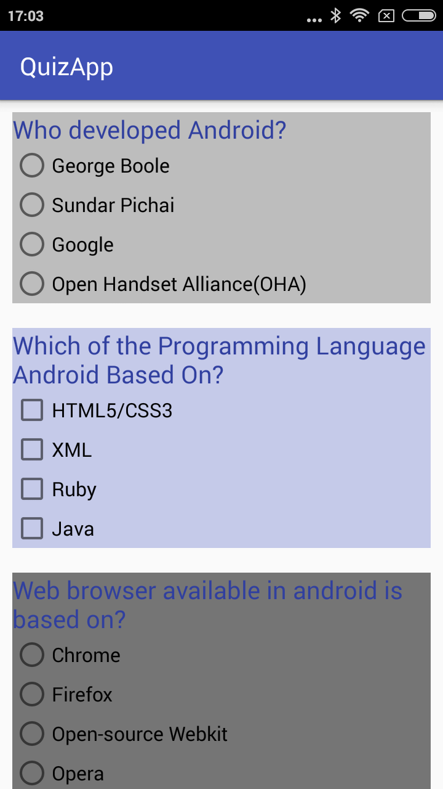
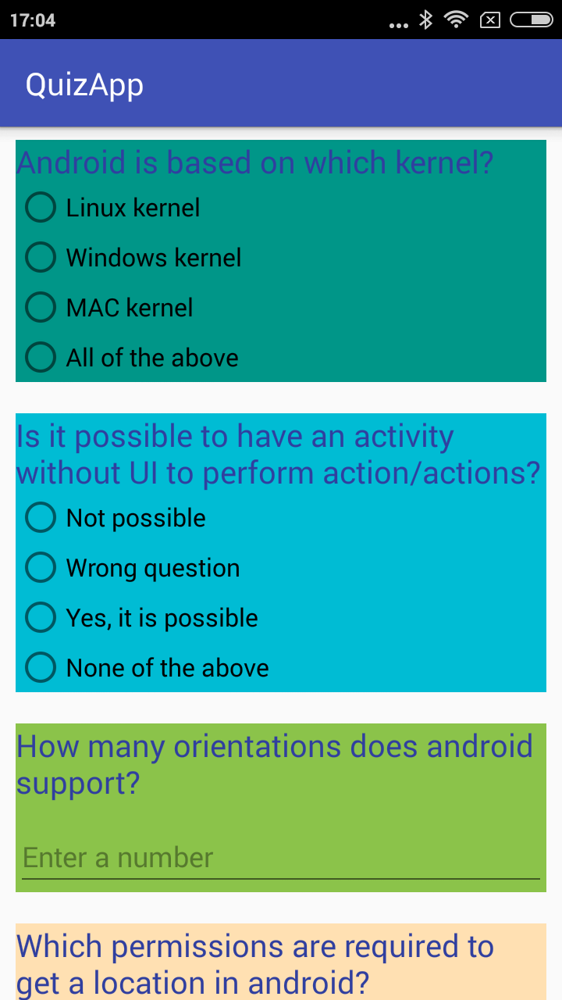
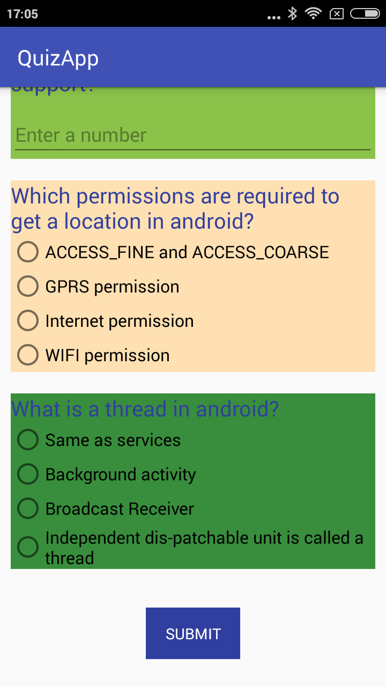

# quiz-app
Educational app that quizzes a user about a certain topic of your choice

# What I Learn
This project is about combining various ideas and skills that I have practiced throughout the course. 
They include:
1. Planning app design before coding.
2. Taking an app layout from drawing to XML code.
3. Creating, positioning, and styling views.
4. Creating interactivity through button clicks and Java code.
5. Commenting and documenting the code.

# Procedure to build quiz app
1. First, build the layout. This involves creating the quiz questions, deciding what type of quiz they will be, and formatting them in the xml layout file for your Activity.
2. Second, you'll want to write code that links the layout to the activity. For step 3, you'll want variables that refer to each of the quiz answers.
3. Finally, write the code for the button which checks your answers. This code should run through each question in the app, record whether the user got the question right, and then display the quiz results in a Toast message.

## Final Output - Screenshots

Screen 1                        |Screen 2                        |Screen 3
:------------------------------:|:------------------------------:|:------------------------------:|
|||
